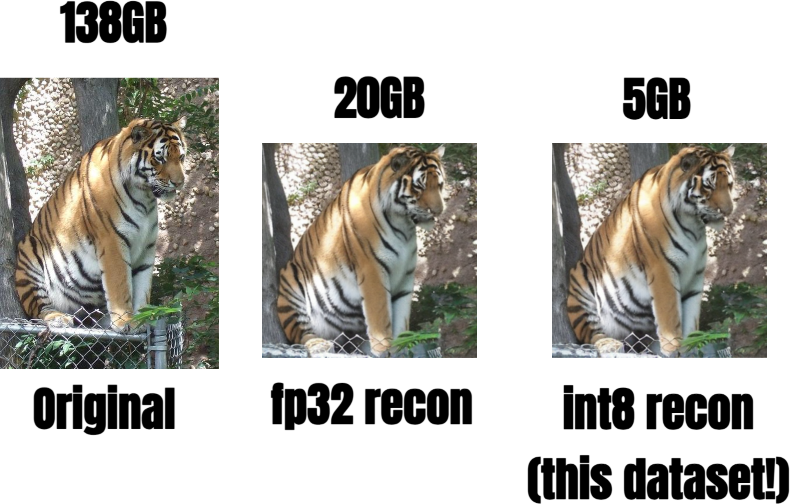

# Imagenet.int8: Entire Imagenet dataset in 5GB


<p align="center">
  
</p>

*original, reconstructed from float16, reconstructed from uint8*

<a href='https://huggingface.co/datasets/cloneofsimo/imagenet.int8'></a>


Find 138 GB of imagenet dataset too bulky? Did you know entire imagenet actually just fits inside the ram of apple watch?

* Resized, Center-croped to 256x256
* VAE compressed with [SDXL's VAE](https://huggingface.co/stabilityai/sdxl-vae)
* Further quantized to int8 near-lossless manner, compressing the entire training dataset of 1,281,167 images down to just 5GB!

Introducing Imagenet.int8, the new MNIST of 2024. After the great popularity of the [Latent Diffusion](https://arxiv.org/abs/2112.10752) (Thank you stable diffusion!), its *almost* the standard to use VAE version of the imagenet for diffusion-model training. As you might know, lot of great diffusion research is based on latent variation of the imagenet. 

These include: 

* [DiT](https://arxiv.org/abs/2212.09748)
* [Improving Traning Dynamics](https://arxiv.org/abs/2312.02696v1)
* [SiT](https://arxiv.org/abs/2401.08740)
* [U-ViT](https://openaccess.thecvf.com/content/CVPR2023/html/Bao_All_Are_Worth_Words_A_ViT_Backbone_for_Diffusion_Models_CVPR_2023_paper.html)
* [Min-SNR](https://openaccess.thecvf.com/content/ICCV2023/html/Hang_Efficient_Diffusion_Training_via_Min-SNR_Weighting_Strategy_ICCV_2023_paper.html)
* [MDT](https://openaccess.thecvf.com/content/ICCV2023/papers/Gao_Masked_Diffusion_Transformer_is_a_Strong_Image_Synthesizer_ICCV_2023_paper.pdf)

... but so little material online on the actual preprocessed dataset. I'm here to fix that. One thing I noticed was that latent doesn't have to be full precision! Indeed, they can be as small as int-8, and it doesn't hurt!

So clearly, it doesn't make sense to download entire Imagenet and process with VAE everytime. Just download this, `to('cuda')` the entire dataset just to flex, and call it a day.😌

(BTW If you think you'll need higher precision, you can always further fine-tune your model on higher precision. But I doubt that.)


# How do I use this?

First download this. You can use `huggingface-cli` for that. 

```bash
# Pro tip : use `hf_transfer` to get faster download speed.
pip install hf_transfer
export HF_HUB_ENABLE_HF_TRANSFER=True
# actual download script. 
huggingface-cli download --repo-type dataset cloneofsimo/imagenet.int8 --local-dir ./vae_mds
```


Then, you need to install [streaming dataset](https://github.com/mosaicml/streaming) to use this. The dataset is MDS format.

```bash
pip install mosaicml-streaming
```

Then, you can very simply use the dataset like this:

(for more info on using Mosaic's StreamingDataset and MDS format, [reference here](https://docs.mosaicml.com/projects/streaming/en/stable/index.html))

```python
from streaming.base.format.mds.encodings import Encoding, _encodings
import numpy as np
from typing import Any
import torch
from streaming import StreamingDataset

class uint8(Encoding):
    def encode(self, obj: Any) -> bytes:
        return obj.tobytes()

    def decode(self, data: bytes) -> Any:
        x=  np.frombuffer(data, np.uint8).astype(np.float32)
        return (x / 255.0 - 0.5) * 24.0

_encodings["uint8"] = uint8

remote_train_dir = "./vae_mds" # this is the path you installed this dataset.
local_train_dir = "./local_train_dir"

train_dataset = StreamingDataset(
    local=local_train_dir,
    remote=remote_train_dir,
    split=None,
    shuffle=True,
    shuffle_algo="naive",
    num_canonical_nodes=1,
    batch_size = 32
)

train_dataloader = torch.utils.data.DataLoader(
    train_dataset,
    batch_size=32,
    num_workers=3,
)
```

By default, batch will have three attributes: `vae_output`, `label`, `label_as_text`.

Thats the dataloader! Now, below is the example usage. Notice how you have to reshape the data back to `(B, 4, 32, 32)` as they are decoded flattened.

```python
###### Example Usage. Decode back the 5th image. BTW shuffle plz
from diffusers.models import AutoencoderKL
from diffusers.image_processor import VaeImageProcessor

model = "stabilityai/your-stable-diffusion-model"
vae = AutoencoderKL.from_pretrained("stabilityai/sdxl-vae").to("cuda:0")

batch = next(iter(train_dataloader))

i = 5
vae_latent = batch["vae_output"].reshape(-1, 4, 32, 32)[i:i+1].cuda().float()
idx = batch["label"][i]
text_label = batch['label_as_text'][i]

print(f"idx: {idx}, text_label: {text_label}, latent: {vae_latent.shape}")
# idx: 402, text_label: acoustic guitar, latent: torch.Size([1, 4, 32, 32])

# example decoding
x = vae.decode(vae_latent.cuda()).sample
img = VaeImageProcessor().postprocess(image = x.detach(), do_denormalize = [True, True])[0]
img.save("5th_image.png")
```

Enjoy!

# Citations

If you find this material helpful, consider citation!

```bibtex
@misc{imagenet_int8,
  author       = {Simo Ryu},
  title        = {Imagenet.int8: Entire Imagenet dataset in 5GB},
  year         = 2024,
  publisher    = {Hugging Face Datasets},
  url          = {https://huggingface.co/datasets/cloneofsimo/imagenet.int8},
  note         = {Entire Imagenet dataset compressed to 5GB using VAE and quantized with int8}
}
```

